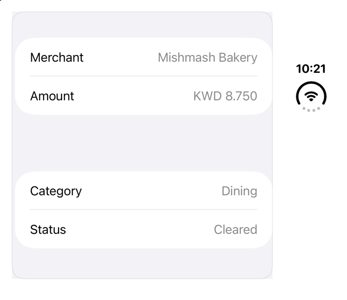

<!-- Generated by `sweetui generate catalog` from Registry metadata. Do not edit by hand; edit the item document and regenerate. -->

# fold-arrangement

Two panes around the iPhone Duo fold: native ArrangementView.



More previews: [dark](../images/items/fold-arrangement-dark.png)

Nothing to install. Copy the snippet below

## Usage

```swift
ArrangementView {
    List {
        LabeledContent("Merchant", value: "Mishmash Bakery")
        LabeledContent("Amount", value: "KWD 8.750")
    }
} secondary: {
    List {
        LabeledContent("Category", value: "Dining")
        LabeledContent("Status", value: "Cleared")
    }
}
.arrangementViewStyle(.split)
.registryItem("fold-arrangement")
```

## Why native is enough

`ArrangementView` (iOS 27.1): two panes that always show. `.split` puts them side by side or stacked by container shape and keeps both out of an active fold; `.split.axes(.horizontal)` shows only the primary pane in a vertical layout; `.overlay` layers the primary over the secondary until the device half opens. Do not nest it in a `List`, `ScrollView`, or `NavigationSplitView` (Apple). Measured on the iPhone Duo simulator, iOS 27.1: flat open, `.split` halves the container and ignores the inactive fold; an empty secondary still keeps its pane. For a companion that opens and closes, install `fold-companion`. A custom layout reads `GeometryProxy.reservedRegions(kind: .division, options: .includeInactive)`; the region's `frame` includes its margins. The hinge angle (`onHingeChange`) drives effects only, never layout. A toolbar item joins the vertical bar only with a title and a symbol (`Button("Details", systemImage:)`).

## Details

- Kind: recipe
- Version: 0.1.0
- Platforms: iOS 27.1+
- Accessibility contract:
  - Both panes stay in reading order: primary, then secondary.
  - System places panes; Dynamic Type and right to left follow the content.
