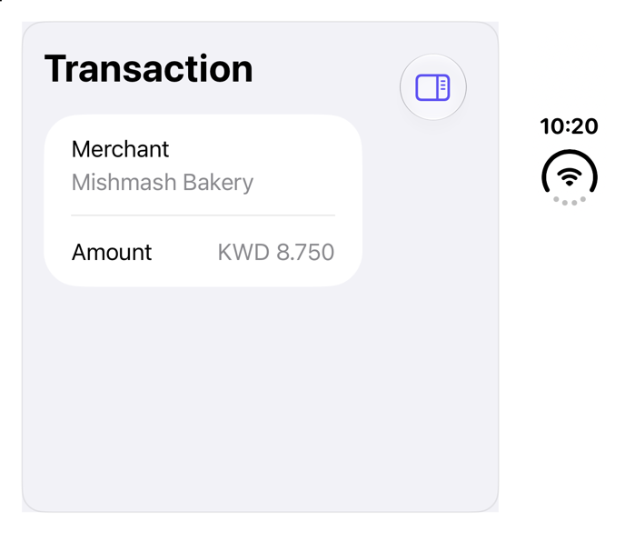

<!-- Generated by `sweetui generate catalog` from Registry metadata. Do not edit by hand; edit the item document and regenerate. -->

# fold-companion

Companion pane across the iPhone Duo fold; sheet on every other display.



More previews: [dark](../images/items/fold-companion-dark.png)

## Install

```sh
sweetui install fold-companion --destination Sources/YourFeature/Components
```

Point `--destination` at a folder inside the consuming target's sources, such as `Sources/YourFeature/Components`, so the copied files are members of that build target

Then add package https://github.com/mangobyte-dev/sweetui.git (from 0.5.0 up to the next minor version) and link product SweetUIFoundations

```swift
// Package.swift
dependencies: [
    .package(url: "https://github.com/mangobyte-dev/sweetui.git", .upToNextMinor(from: "0.5.0"))
]

// In the consuming target's dependencies:
.product(name: "SweetUIFoundations", package: "sweetui")
```

In an Xcode app project instead, choose File > Add Package Dependency, enter https://github.com/mangobyte-dev/sweetui.git with the same version rule, and add the SweetUIFoundations product to your app target

Verify the install by building the consuming target for an iOS Simulator destination

## Usage

```swift
@State private var isShowingDetails = false

NavigationStack {
    List {
        LabeledContent("Merchant", value: "Mishmash Bakery")
        LabeledContent("Amount", value: "KWD 8.750")
    }
    .navigationTitle("Transaction")
    .toolbar {
        Button("Details", systemImage: "sidebar.trailing") {
            isShowingDetails.toggle()
        }
    }
    .foldCompanion(isPresented: $isShowingDetails) {
        List {
            LabeledContent("Category", value: "Dining")
            LabeledContent("Status", value: "Cleared")
        }
    }
}
```

## Details

- Kind: component
- Version: 0.1.0
- Platforms: iOS 26.0+
- Registry dependencies: none
- Accessibility contract:
  - Companion keeps its open state across poses; only the person closes it.
  - Off the fold: system sheet, VoiceOver dismiss; on the fold: second pane in reading order.
- Source: [sources/components/FoldCompanion.swift](../../Registry/sources/components/FoldCompanion.swift), with the `Fold Companion` Xcode preview
